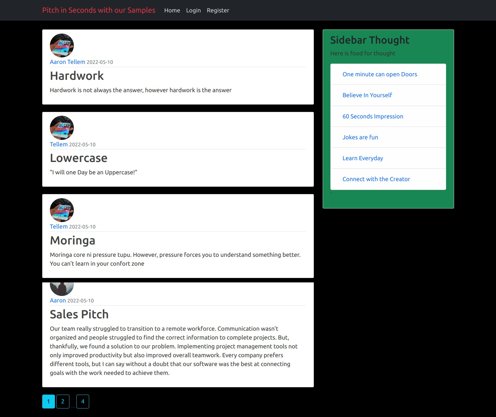

# Perfect Pitches to get you started

#### Pitches website features quotes that worked for others when creating their first impression in an interview, social gathering or promoting content. Feel free to log on and share yours too!

#### By **Aaron Ekal, May 2022**

## Description

In life, 1 minute can make or break you. How do we make sure that you use your 1 minute to actually say something meaningful? This application helps you do exactly that by getting sampleas from different people. You can add yours!

## Setup/Installation Requirements

- You need a good perfoming computer/laptop: Core i3 or equivalent with high resolution display
- Clone from Github
- Open terminal on the cloned folder
- Run chmod a+x start.sh
- Run ./start.sh
- Easy Peasy😉
- Alternatively, go [here](https://pitch-in-seconds.herokuapp.com/)

## Known Bugs

There are no known bugs currently but I look forward to improving the overall user experience

## Technologies Used

This site was made entirely using:

- HTML
- CSS
- Python|Flask|SQLAlchemy
- PostgreSQL
- Bootstrap

## Support and contact details

I'd love to chat! Ping me on [Twitter](https://twitter.com/aaronekal) should any issues arise, or just say Hi!

### License

_MIT Licence_
Copyright &copy; 2022 **Aaron Ekal**